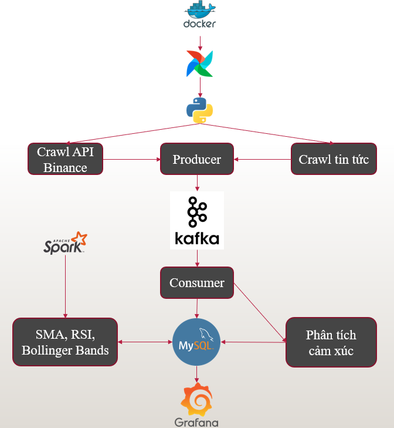
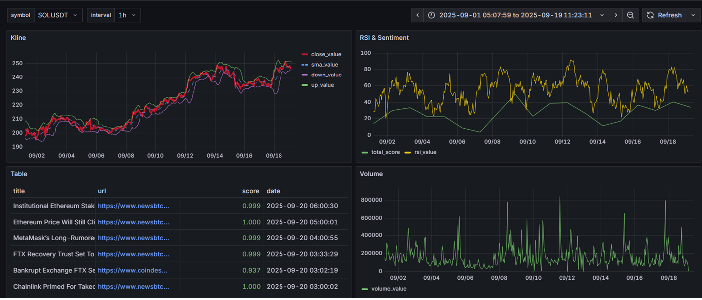

# 🚀 Crypto Data Pipeline (with Apache Kafka)

### 🧠 Data Engineering Capstone Project  
**Author:** Nguyễn Ngọc Nam  
**Mentor:** Cù Hữu Hoàng  
**Location:** Ho Chi Minh City, Vietnam — 2025  

---

## 🎯 About This Project
This project was developed as part of my **Data Engineering capstone**, aiming to build a **real-world data pipeline** that automates the entire process from **data ingestion to visualization**.

Through this project, I applied key data engineering concepts such as:
- Workflow orchestration with **Apache Airflow**  
- Distributed data processing using **Apache Spark**  
- **Streaming integration** using **Apache Kafka**  
- **ETL and warehouse design** with the Dim–Fact model  
- **Docker-based deployment** for consistent and portable environments  

It demonstrates my ability to design **end-to-end pipelines**, integrate **multiple data sources**, and process streaming data in real-time.

---

## 📘 Overview
**Crypto Data Pipeline** is an **end-to-end Data Engineering system** designed to automatically **collect, stream, process, analyze, and visualize** cryptocurrency market data.  
The system integrates **Apache Kafka** to enable **real-time data flow** between crawlers (producers) and consumers, which process and store the data for analytics and visualization.

**Main Objectives:**
- Enable **real-time ingestion** using Apache Kafka.  
- Automate **data transformation and analysis** using Airflow and Spark.  
- Combine **quantitative (price)** and **qualitative (news sentiment)** data.  
- Visualize data and indicators using Grafana.  

---

## 🏗️ System Architecture



---

## 🧩 Key Features

| Category | Description |
|-----------|-------------|
| **Kafka Integration** | Implements **Producer–Consumer architecture** for real-time message streaming. Crawled data is sent to Kafka topics instead of being stored directly in MySQL. |
| **News Pipeline** | Producer crawls crypto news (Coindesk, NewsBTC) → sends messages to Kafka → Consumer stores to MySQL. |
| **Price Pipeline** | Binance price data is pushed into Kafka topic and consumed for processing. |
| **Indicator Pipeline** | Spark consumes stored data to compute SMA, RSI, and Bollinger Bands. |
| **Workflow Orchestration** | Airflow coordinates Producer → Consumer → Spark → Visualization. |
| **Visualization** | Grafana displays both real-time and processed metrics. |

---

## 🗂 Project Structure
```text
crypto-pipeline/
├── dags/
│   ├── producer_news.py
│   ├── consumer_news.py
│   ├── producer_prices.py
│   ├── consumer_prices.py
│   └── spark_job.py
├── sql/
│   ├── kline_dim_fact.sql
│   ├── indicator_dim_fact
│   └── news_dim_fact.sql
├── docker-compose.yaml
├── requirements.txt
└── README.md
```

---

## 🛠️ Technology Stack

| Layer | Tools / Technologies |
|-------|----------------------|
| **Message Streaming** | Apache Kafka |
| **Workflow Orchestration** | Apache Airflow |
| **Data Processing** | Apache Spark |
| **Data Storage** | MySQL (Data Warehouse – Dim–Fact Model) |
| **Data Crawling & NLP** | Python (Requests, BeautifulSoup4, NLTK Vader) |
| **Visualization** | Grafana |
| **Deployment** | Docker, Docker Compose |

---

## ⚙️ Installation (Docker)

1. **Clone the Repository**
   ```bash
   git clone https://github.com/your-username/crypto-pipeline.git
   cd crypto-pipeline
   ```

2. **Start All Services**
   ```bash
   docker-compose up -d --build
   ```
   **Services included:**
   - `kafka` (Message streaming platform)
   - `zookeeper` (Kafka dependency)
   - `mysql` (Database `thesis`)
   - `airflow` (Webserver, Scheduler, Worker)
   - `spark` (Processing engine)
   - `grafana` (Visualization)

3. **Access Interfaces**
   - **Airflow UI:** [http://localhost:8080](http://localhost:8080)  
     *default: airflow / airflow*  
   - **Kafka UI (optional):** [http://localhost:9021](http://localhost:9021)  
   - **Grafana UI:** [http://localhost:3000](http://localhost:3000)

---

## ▶️ Usage Guide
## 🚀 Running the Pipeline
Below are the steps to execute the full end-to-end data pipeline manually or using Airflow.

Step	Description
1️⃣ Start Producers	Run the producer scripts manually to publish data to Kafka topics:
• producer_news.py → Crawls latest crypto news and sends messages to Kafka topic news_topic.
• producer_prices.py → Collects Binance price data and sends messages to Kafka topic price_topic.
2️⃣ Start Consumers	Run the consumer scripts to read and store data:
• consumer_news.py → Consumes data from news_topic, performs sentiment analysis, and writes results to MySQL.
• consumer_prices.py → Consumes data from price_topic, cleans and stores price information in MySQL.
3️⃣ Run Spark Job	Execute spark_job_1.py (either manually or via Airflow DAG spark_indicator) to compute SMA, RSI, and Bollinger Bands from the processed data.
4️⃣ Visualize in Grafana	Open Grafana to view real-time metrics, technical indicators, and sentiment analytics from the crypto data warehouse.

## 📊 Example Outputs

### News Data (`news_fact`)
| id | title | sentiment_score | tag_name | created_date |
|----|--------|-----------------|-----------|---------------|
| 1 | Bitcoin Price Surges | 0.67 | Bitcoin | 2025-09-14 12:00:00 |

### Technical Indicators (`indicator_fact`)
| id | symbol_id | type | value | timestamp |
|----|------------|------|--------|------------|
| 1 | 1 | SMA | 42000.123 | 2025-09-14 12:00:00 |
| 2 | 1 | RSI | 55.67 | 2025-09-14 12:00:00 |

---

## 📈 Results

✅ **Real-time streaming** between producer and consumer via Kafka.  
✅ **Fully automated pipeline** orchestrated by Airflow.  
✅ **Spark integration** for large-scale technical analysis.  
✅ **Data warehouse** designed for analytical workloads.  
✅ **Dockerized system** for portable deployment.  
✅ **Grafana dashboards** showing live crypto trends and sentiment.  

---

## 💡 Limitations & Future Improvements

| Current Limitation | Future Improvement |
|---------------------|--------------------|
| Batch-based Spark processing | Add **Spark Structured Streaming** for full real-time analytics |
| Limited Kafka topic coverage | Expand topics for multiple crypto pairs and sentiment sources |
| Simple text-based sentiment | Integrate deep learning models (BERT, FinBERT) |
| MySQL scalability | Move to distributed storage like BigQuery or Snowflake |

---

## 📊 Dashboard Preview


---

## 🙌 Acknowledgments
- [Apache Kafka](https://kafka.apache.org/)
- [Apache Airflow](https://airflow.apache.org/)
- [Apache Spark](https://spark.apache.org/)
- [NLTK Vader Sentiment](https://www.nltk.org/_modules/nltk/sentiment/vader.html)
- [Grafana](https://grafana.com/)

---

## 🧾 License
This project is for **educational and research purposes only**.  
© 2025 Nguyễn Ngọc Nam — Data Engineering Project.
